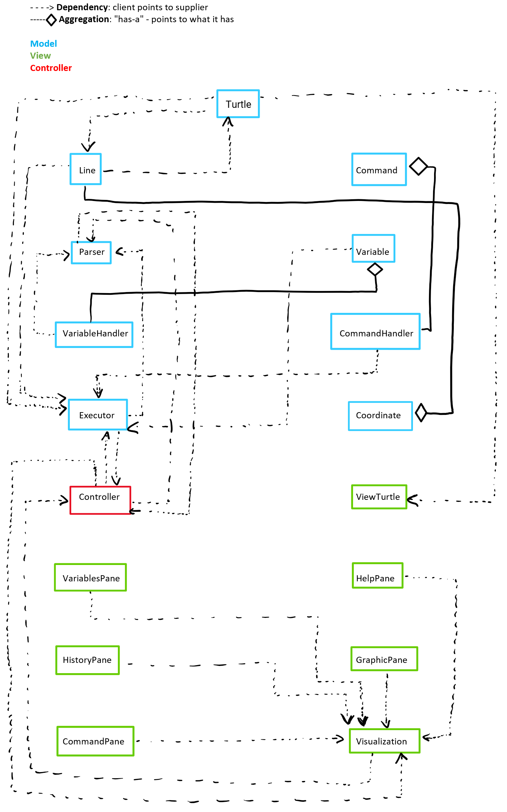

## Introduction:

We are trying to create a program using Java to simulate the Logo programming language. The Logo interpreted programming language allows users to control a “turtle” on screen and allows them to draw (or not) things using various commands. It was intended to teach programming to children and we want to replicate that functionality in our JavaFX program.

The large scale primary design goals of this program are to create a clean, easily expandable, and easy to understand code base that implements all the features required for the Logo programming environment. Our program should be most flexible in the addition of new features to the code. Programmers should easily be able to add new commands that add functionality without having to change multiple areas in the project. On the UI side, they should easily be able to change the look and feel (styling) of the project as well as add new custom panes that can display information that they wish to.

According to the open-closed principle, modules that are open are allowed to be extended and modules may be modified to behave in new and different ways. Some of what we want to be open are the command base options. We want to be able to add new commands easily to allow the user to do new and different actions to what already exists. Additionally, we want to keep the user UI information display panes open to extensions. There may be new information that a programmer may want to display and so these UI panes may be open to displaying this new information to the user. Closed code refers to source code that should not be modified in any way.
 While someone can add on to the command base, they should not be able to change the existing default commands in any way. With regards to the turtle, it should be open in the sense that someone can extend it to create a new turtle with maybe some visual changes. However, it should be closed in the sense that no one should be able to change or delete the existence of at least the original turtle.
Some of the UI components should be closed. There is no reason to change the command input box or the display square and so that source code should be closed.

At a high level, users will be able to enter commands using the LOGO language and execute them. The results of these commands could just be mathematical operations output in the console, or they could also animate the turtle in the main window. This could include moving the turtle, rotating the turtle, and also using the turtle to draw lines. Users will be able to configure the program to their liking, by changing the pen and background color, and also being able to change the image that is used for the turtle.

## Overview:

The four APIs that will be created are the front-end external API, the front-end internal API, the back-end internal API, and the back-end external API.

The front-end external API will be responsible for updating window UI elements that the user will interact with after commands are parsed and executed, such as the turtle’s position, the turtle’s pen trail, the window’s visibility, and some of the other window panes. These updates will be incited by commands parsed and executed by the back-end.

The front-end internal API will be responsible for updating window UI elements that are not incited by commands processed back the backend. Some examples of these behaviors include updating the environmental variable window, updating the command window, setting the turtle’s pen color, and setting the turtle’s display image.

On another note, back-end internal API will be responsible for parsing and executing the commands passed along from the user’s input on the UI window. The classes and methods in this arena will be hidden from the front-end. This is where we execute commands and change our back-end Turtle object’s data, like position and heading.

The back-end external API, however, will feature the accessor methods visible to the front-end so that the front-end can determine how to appropriately update itself after a command has been executed. For example, this is where the Turtle’s getPosition() and getHeading() methods will be.

One example of a dual use implementation, would be the implementation of the Variable and VariableHandler class. In these classes the variable could be either a map, where the key is the name and the value is the variable’s value. Or it could be a double list structure where the key and value are both put into a list at the same index. The public Variable getVariable(Variable var) method from the VariableHandler class will, regardless of data structure, implement this functionality. In a map it can directly return the variable object based on the key. In the double list it can loop through to find the right index, make the Variable object and return it.

Another example of dual use implementation is our CommandHistory class. One implementation we could have done for our history of commands in the back-end is to just have a list of command objects. However, using this could become cumbersome as we get more and more commands, but also, this does not totally encapsulate data, especially if we are forced to pass around a list of commands. By using a CommandHistory class that essentially stores all of the executed commands, we could use any kind of list to store the commands, or maybe even a map that indicates the execution order of the commands with some sort of key. When the front-end tries to getCommandHistory(), it doesn’t care about how the CommandHistory class actually stores that data, as long as it gets the data in the form that it expects. In this case, it might be useful to return an unmodifiable list, since you don’t want the front-end editing command history.

### Diagram
 

Below, we have a list of the 4 API’s and their corresponding methods. Below that list, we have split up the methods into their corresponding classes.

## API Methods:

#### Front-End External API:

- updateViewTurtlePosition()
- updateTrails();
- updateView();update all the panes
- toggleVisibility(); (changes turtle’s visibility)
- clearScreen();
- displayError();
- updateVariableWindow()
- updateCommandWindow()
- updateHistoryWindow()

#### Front-End Internal API:

- setPenColor()
- setTurtleImage()
- setBackgroundColor()
- setLanguage()
- accessHelp()

#### Back-End Internal API:

- executeCommand()
- setPosition()
- setHeading()
- drawTurtleLine()
- All Command instructions go in here
- splitCommands()
- getCommands()
- updateCommandHistory()
- makeVariable()
- setVariable()
- flipPen()

#### Back-End External API

- getTurtlePosition()
- parseCode()
- getCommandHistory()
- getHeading()
- getLines()
- getLineEndpoints()
- getVariable()

## Classes:

We will use an MVC approach, with a model(back-end), view(front-end) and a controller to communicate between the two.

## Model:

#### Turtle:

- setPosition()
- getPosition()
- getHeading()
- setHeading()
- flipPen()
- drawLine()
- getLines()

#### Line:

- getLineEndpoints()

#### Command:

- Base Command class extended by all below:

- Command to Move(x, y, …)
     - Defines forward
     - Backwards
     - Left
     - Right
- Math(input num)
    - Cos, Sine, Tan, etc
    - Returns a float

- penUp
- penDown
- setHeading(degrees)
- towards(x,y)
   - Calculate angle using Math commands
   - Returns value into setHeading
- toggleVisibility()
    - Show or hide the turtle
- goHome()
- Boolean operations
- clearScreen()
    - Remove all pen markings
    - Calls goHome()

#### Parser:

- splitCommands();
- getCommand();

#### Variable:
- setVariable()
- updateVariable()

#### VariableHandler:

- getVariable()
- makeVariable()

#### CommandHandler:

- getCommandHistory()
- updateCommandHistory()

#### Executor:
- executeCommand();

#### Coordinate

- getX()
- getY()

## Controller:

The controller part of this project will facilitate communication between the model and the view. So, the front-end and back-end will never explicitly communicate with each other.

#### Controller:

- updateViewTurtlePosition()
- updateTrails();
- updateView();
- toggleVisibility();
- clearScreen();
- displayError();
- getTurtlePosition()
- getTurtleHeading()
- parseCode()
- getCommandHistory()
- getHeading()
- getLines()
- getVariable()

## View:

- viewTurtle:

    - updatePosition()
    - updateHeading()
    - toggleVisibility()
    - setTurtleImage()

- Visualization:

    - updateView()
    - updatePanes()
        - updateVariablesWindow()
        - updateGraphicsWindow()
        - updateCommandWindow()
        - updateHistoryWindow()
    - clearScreen()
    - displayError()
    - setLanguage()
    - accessHelp()

- GraphicPane
    - updateTrails()
    - setBackgroundColor()
    - setPenColor()

- HistoryPane
    - updateWindow()

- CommandPane
    - updateWindow()

- VariablesPane
    - updateWindow()

- HelpPane
    - display()

#### Picture of how APIs are related

## User Interface

 The main window present in the userInterface will be the
 window with the turtle and the canvas that it will draw on. This will
 be towards the right middle of the screen. To the left of that will be
 the pane that displays the history of previously executed commands.
 Below this will be the window where users can enter code and execute
 commands. To the right of the main canvas will be the variable window
 and the available user commands. At the top will be a toolbar, where
 users can select background color, pen color, language, and turtle
 image.	Users will interact with the toolbar by clicking on its separate
 components and getting drop-down menus to select the different options.
 Users can type code into the command window, and also scroll through
 it. The command history window is also scrollable for users.	If any
 errors are thrown, they will be displayed as a pop-up alert that
 displays a message that will be understandable to a user. This can
 include bad input data, unrecognized command, math errors(like divide
 by 0), or incorrect syntax used when entering in code. The user can
 then click out of these alert boxes, and continue coding in the console
 below.

##### ADD IMAGE OF USER INTERFACE

## Design Details

Our program will be split into three main packages - model, view, and controller with both front and back end’s containing their respective classes that implement internal and external API methods.

Front-end = view, back-end = model(will be using words interchangeably)

#### Front-end external API

- updateViewTurtlePosition()
    - this will be in the controller and connects to the backend to update the front-end turtle’s position
- updateTrails();
    - This will be how the lines and trails left by the turtle will be updated on the graphics screen
- updateView();  - update all the panes
    - In the Controller. Gets the required data from the backend to update front-end UI
- toggleVisibility(); (changes turtle’s visibility)
    - Takes in the user data and updates the front-end to toggle the state of visualTurtle’s visibility
- clearScreen();
    - Connects the front end to the backend to remove elements from the back-end and reflect the changes in the front end
- displayError();
    - Gets the cause of the error from the back-end and then displays an alert box to the user in a comprehensible manner
- updateVariableWindow()
    - Uses Controller as an interface to get data from the Model and update the variable pane
- updateCommandWindow()
    - Uses Controller as an interface to get data from the Model and update the command pane
- updateHistoryWindow()
    - Uses Controller as an interface to get data from the Model and update the window pane

Above are the general methods we will be using in the external front-end API, as was discussed in the overview. When designing the front-end external API, we felt that the most important role this API would have would be to allow the back-end to make any necessary changes to the front-end view, based on what commands were executed. Essentially, for any logo commands that directly involve changes on the front-end for the user, we have created a method in the front-end API so the model can update it accordingly. Essentially, this API fulfills the requirement of having “the results of the turtle executing commands displayed visually”.

This API will be using the ViewTurtle so it can update turtle positions and headings accordingly on the view based on what commands were executed. Having this separate turtle object specifically for the view helped us keep the front-end and back-end separated, and ensure that each component only has the information it needs. For example, the user can set the turtle to be different images, so the ViewTurtle would need an image associated with it. However, the model Turtle would not need to know about that kind of information, so having two separate turtle classes helps ensure that information is kept separate.

Besides the viewTurtle object, this API will be using separate classes for each pane in the user interface for this project. When updatePanes() is called, we then update the pertinent panes inside the environment. This is open for extension, since if we ever need to add more components to our user interface, we could just create another specific window object, just like the HistoryWindow and VariablesWindow, and have the updatePanes() method update those windows as well.

#### Front-end internal API

- setPenColor()
    - This method will not connect with any other part of the code and will take input from the user to specify a pen color used to draw lines
- setTurtleImage()
    - This will not connect with any other part of the code and will ask a user for an image and then set it as the turtle image
- setBackgroundColor()
    - This method with take an input from the user to set the background color of the window
- setLanguage()
    - The language method will take an input from the user to toggle the resources property file used define the text.]
- accessHelp()
    - This will display a help screen when a user accesses it on the toolbar

The above methods are the general methods used in the Front-end API. This API communicates with the controllers like buttons to handle user inputs graphically. The most important aspect of this API is to ensure that no other part of the code can access these methods and change the information there. This API will fulfill the requirement of having the front end turtle and information panes reflect the changes occurring only in the front end. For example these change include changes that are specific only to the UI. The language used and the pen color do not have an effect on the back end state of the program. The back end turtle and the back end data holders like the variablehandler and the command history do not have use for this information. The help screen is also something that requires to attachment to the back end. This information is static and will not require any updates in the back end to be reflected here. The same can be said for the background color. This is UI specific and set by the user and so updates to the backend are not required from changing the background.

#### Back-End Internal API:

- executeCommand()
    - This will execute Commands in the Executor class after the parser has parsed user input
- setPosition()
    - This will set the position of the Turtle based on an executed command
- setHeading()
    - This will set the heading of the Turtle based on an executed command
- drawTurtleLine()
    - This will go in the Turtle class and will create an appropriate line object when a turtle moves and it’s pen is down
- All Command instructions go in here
    - All Command instructions will have execute() methods that define what they do when executed.
- getCommands()
    - Gets a command that is parsed from parser
- updateCommandHistory()
    - Updates command history in CommandHandler when a new command is received from parser
- makeVariable()
    - Makes a new variable in VariableHandler based on data from Parser class
- setVariable()
    - This sets the value of a variable in VariableHandler based on data from Parser  class
- flipPen()
    - This toggles the pen state for the back-end turtle, essentially changing whether or not the turtle creates new lines when it moves

This API parses commands written in the console window to control the turtle, and pen. It will parse commands and execute the predefined commands. Using loops, conditionals, procedures, and hashing, this API calls methods that are suitable for the parsed commands by creating the necessary objects. This API will have Parser class, Executor class, VariableHandler class, CommandHandler class, Line class and Turtle class.

The Parser class will be responsible for parsing commands written in the console window and extracting executable codes from the line of commands. The methods in this class include parseCode, and getCommands. Then it will pass the extracted executable codes to the executor class and variable assignments to the variable HandlerClass. The whole set of commands will be passed to the CommandHandler class to store the command history.

The executor class is responsible for executing commands that are parsed by the Parser class. The main method in this class will be executeCommands which updates the internal data structure of the Turtle, Variable and Pen classes. This class will update the position, and heading of the turtle, and other properties of the internal data structure of the project.

The variable class is responsible for setting variables and updating their values.This class has methods like setVariable that sets the value of a variable in VariableHandler based on data from the  Parser class. In addition to this method, this class will have an updateVariable that updates the previous values of the variables after a modification happens. This class works with the variableHandler class that has the internal data structure that stores the variables with their assigned values.

The variableHandler class is responsible for storing the variables with their assigned values. It has methods makeVariable. This class creates a variable using the makeVariable method and stores its values..

The CommandHandler class’s primary responsibility is to store the previous line of commands written in the console window. This class has a method updateCommandHistory() which updates the internal data structure that stores the previous lines of commands executed by adding the new line of commands read by the parser class.

#### Back-end external API

- getTurtlePosition() 
    - This method will communicate the location of the back end turtle so that the front end turtle can mimic the data held in the back end
- parseCode() 
    - This method will take in information from the frontend (the commands entered) and interact with the back end to execute the logic required to make them work
- getCommandHistory() 
    - The list of commands entered is stored in the back end and this method will be used to take the information out of the backend and communicate it to the front end to display in the command history pane
- getHeading() 
    - The angular direction of the back end turtle will be communicated out
- getLines()  
    - List of lines that the turtle has drawn based on the movement of the turtle and whether the pen was up or down
- getAllVariables()
    - This returns an unmodifiable list of the variables stored in the VariableHandler

Class
- getVariable
    - This returns the variable object associated with a certain variable name in the VariableHandler class

The back-end external API will be responsible for interacting with the front end external API to transfer the required information between the view and the model. Methods are used to get commands from the front end and run them in the back end. Then methods in this API are used to communicate the updated results of those methods to the front end so the results can be displayed to the user.  

##API as Code

We have created packages in our src folder for the model and view with the pertinent interfaces for the different API methods.

## Use Cases:

The user types 'fd 50' in the command window, and sees the turtle move in the display window leaving a trail, and the command is added to the environment's history.

Once the user hits the execute button, the controller will call on the parser to parseCode() from the user’s console input. The controller will then create an executor, which will then call on the parser to getCommand(), which should be a forward command, and then executeCommand(). The result of executeCommand() for a forward command, will call on the back-end Turtle to setPosition(Coordinate newCord) with a new coordinate that is 50 steps in the direction it is headed. It will also call drawLine() in the Turtle object to create a new Line object with the coordinate end points. The executor will then call on commandHandler to updateCommandHistory(Command a) with the command that was just executed. Once the executor is done executing, the controller will tell the Visualization to updateView(). This will call updatePanes which will update the different panes in the environment. It will update the graphics by calling on the viewTurtle to updatePosition by using the getPosition() method from Turtle. It will then updateTrails() in GraphicPane, by using getLines() on the Turtle to draw the various lines with the correct endpoints,  and then use the Visualization interface to update the other panes in the environment. To updateCommandWindow(), the controller will need to call getCommandHistory() on the CommandHandler and give that unmodifiable list to the Visualization.

The user sets the pen's color using the UI so subsequent lines drawn when the turtle moves use that color.
When the user uses the UI to set a new pen color, the setPenColor(Color a) method in the GraphicPane interface is called so that any new lines drawn will be of that color.

#### Saurav Use Cases(Front-End):

- User accesses Help Screen

    To access the help screen, when the user clicks the appropriate button, they will use the accessHelp() method in the visualization interface that will display the appropriate window.

- User changes language
   
    When the user tries to change the programming language, the setLanguage(String languageName) in Visualization will be called. This will change the resources file that is used by the environment to parse through commands.

#### Abebe Use Case (Internal Back-End)

- Creating a variable

    MAKE x=50

    After the user writes the above command in the command window and presses the execute button, the controller will call on the parser to parseCode(). The controller then creates an executor which calls on the parser to getCommand(), which will be a variableHandler command and then the executor executeCommand(). Then the result of the executeCommand() will call on the makeVariable(String variableName, String variableType, String variableValue) method of the variableHandler. The variableHandler adds the new variable to its internal data structure. Finally, the executor will call on commandHandler to updateCommandHistory(Command currentCommand) with the command that was just executed.

- SETHEADING degrees

    After the user writes the commands in the command window and presses the execute button, the controller will call on the parser to splitCommands. The controller then creates an executor which calls on the parser to getCommand(), which should be a Turtle command and then the executor executeCommand(). Then the result of the executeCommand() will call on the setHeading() methods of the Turtle. The heading of the Turtle will be updated in the back- end. Finally, the executor will call on commandHandler to updateCommandHistory(Command newCommand) with the command that was just executed. Once the executor is done executing, the controller will tell theVisualization to updateView(). This call on updatePanes to update the graphical view of the Turtle with its new orientation.

#### Achintya Use Cases
- Getting the command history

     In order to update the command history window pane, I will need to get the information from the command history class that is in the back end. This is where the controller comes into play. It will call the getCommandHistory() method which will access the backend to get the complete list of commands that were written. Then this list can be used by the front-end external method updateCommandWindow() which will update the pane that displays this info.

- Getting the turtle position
     
     Since we are separating the front end and back end with a model turtle and a view turtle, there needs to be a way of communicating information between the two. This is where the controller comes in to call the getTurtlePosition() method which will interact with the backend to get the coordinate location of the backend turtle. Then the front end external API will call updateViewTurtlePosition() which will update the front end turtle's location on the screen.

## Design Considerations

One main design consideration that we had to think about was what should be kept internal for our front-end and what should be kept external. Initially, we thought that the external API should be able to generally updateView() for our window, however, we then would use the internal API to update each specific window. But, we realized that if our external API called and relied on methods in the internal API, that would defeat the purpose of having an external and internal API, since calling the external API would just essentially be calling the internal API. So, we decided that the methods to update all of the specific windows should also go into the external API. We felt this made sense since to update the command history window, you would need to get the command history from the back-end. The same goes for the other windows, like variable window and graphics window. They all need some information from the back-end to update, so it would make sense that they are external, since the back-end would need to access them through the controller. 

Another design consideration we made was whether or not there should be two types of turtles. At first we thought we could just use one turtle object, and have both the front-end and back-end access it to get the necessary information for their tasks. However, from a strict design perspective, we also felt that this would blur the distinction between the front and back-end. If both of them accessed the same component, it would not be ideal, especially because front-end could potentially be able to change back-end data like turtle heading and position, when in reality, only the back-end should be able to change those details once commands have been executed. So, to keep this distinction clear, we decided to make a Turtle object for the back-end, and a viewTurtle for the front-end. While this might at first seem cumbersome, especially for just the basic requirements, having this kind of approach also leaves our program open to extension if we ever need to add more to either the front-end or back-end capabilities of the turtle, without affecting the other end. 

Another main design decision we had to consider was what exactly in our program would handle errors. We knew that the back-end would need to throw errors as it is what actually executes the commands. If there is any bad input data or incorrect command syntax, only the back-end should be able to figure that out. However, from there, we had to decide who would actually display the appropriate error message. Since the front-end environment needs to be able to notify the users of errors in a way that is comprehensible to them,  we decided that our front-end external API should have a method that the back-end can call to display appropriate error messages. As of now, we are planning to do this through the controller. Another alternative could be to have the back-end throw the error straight to the front-end so it doesn’t have to go through a cascade, but this would defeat the purpose of using an MVC approach, so, we decided to stick to using our controller for any model-view inter-communication. 
	

## Team Responsibilities
This section describes the program components
each team member plans to take primary and secondary responsibility for
and a high-level plan of how the team will complete the program.

### Saurav

Saurav will work primarily on the front-end for this project. He will work on implementing the UI and also help with displaying error messages accordingly for users. 

### Achintya

Will work on the interaction between the frontend and back end - essentially the controller. Will work to help Saurav complete any UI components and help the backend team work to design their methods to get information to update the front end.  
